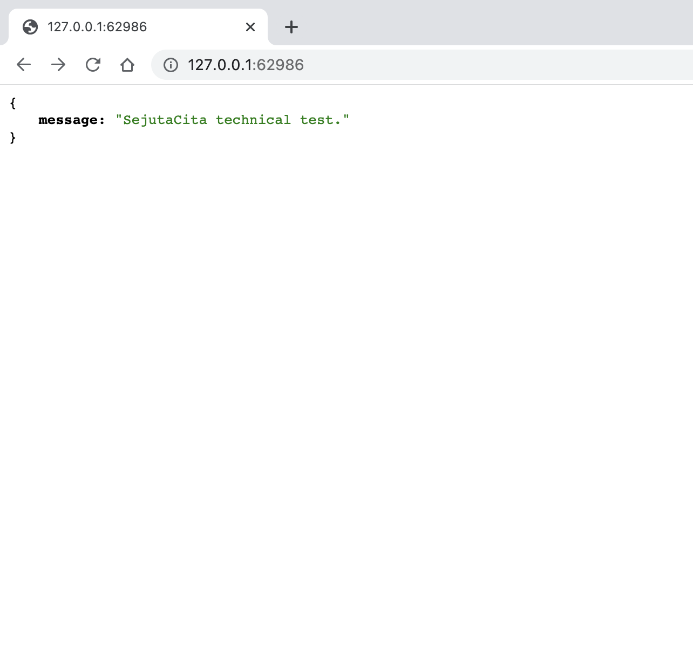

# SejutaCita Technical Test — Readme

# Description

This source code contains a simple role-based authentication server written as technical test by Ulil Albab Surya Negara

# Admin Credential

**Email**: admin@sejutacita.id

**Password**: 123456

# API Documentation

Access route **/api-docs** to access Swagger API Documentation. Due to unresolved bug in swagger-ui-express, request body is sometimes not included in the test request and causing unwanted result. Please consider testing the API with Postman.

# Database Diagram

# Authentication Flow Diagram

Below is the schema of SignUp, Login, Refresh Token, and New Access Token request.

# CRUD Flow Diagram

.png)

# Local Kubernetes Deployment

